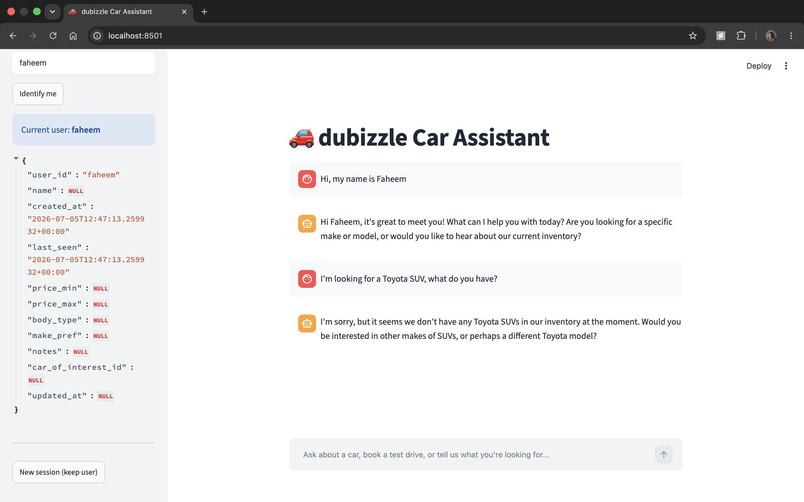
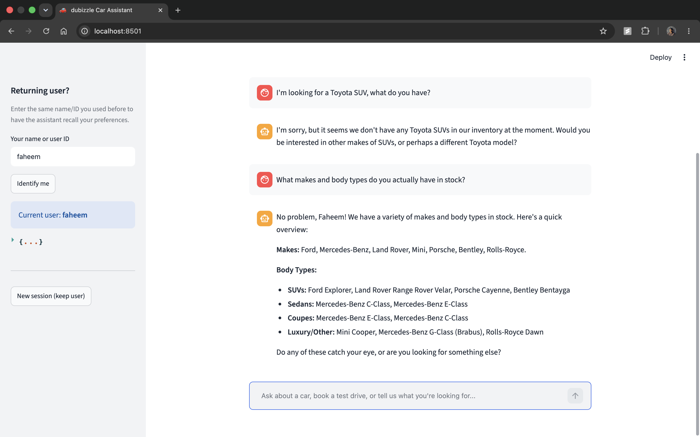
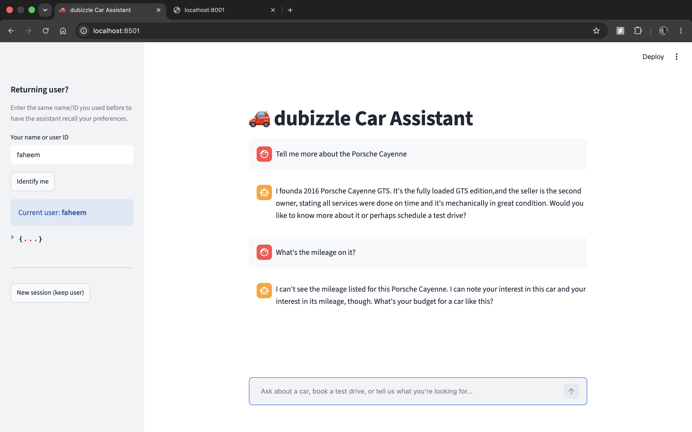
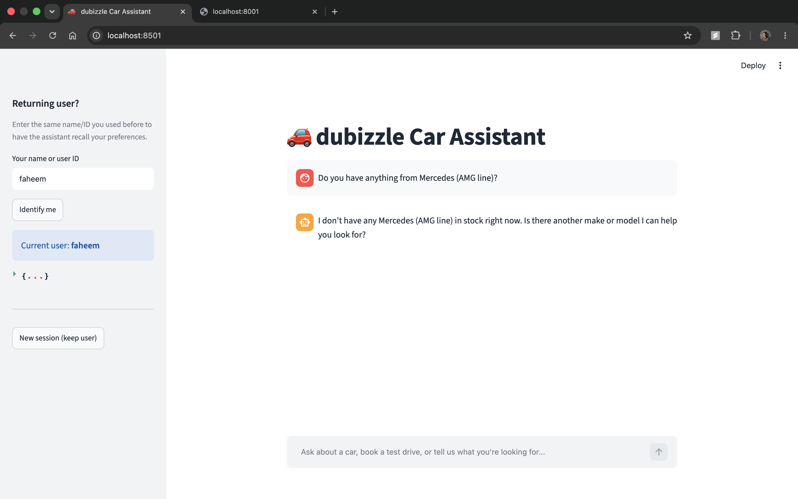
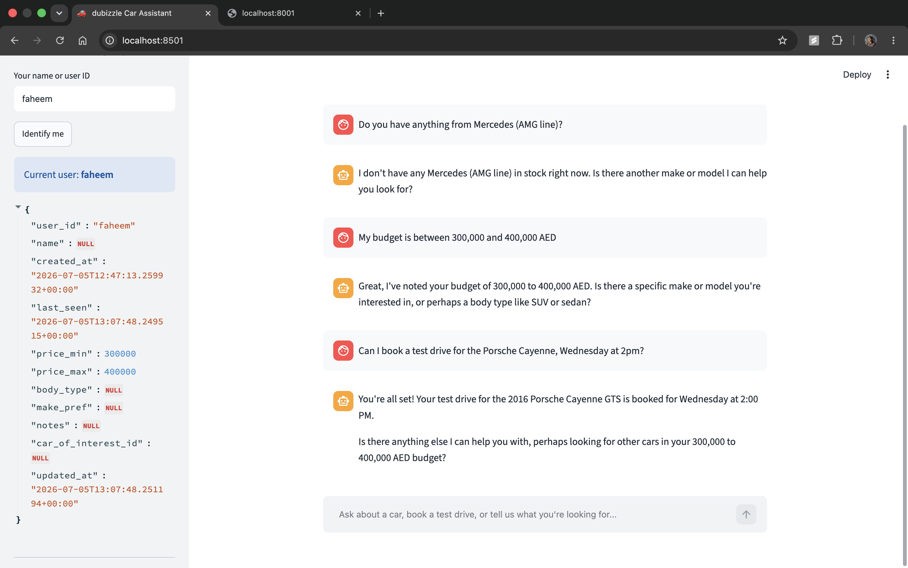
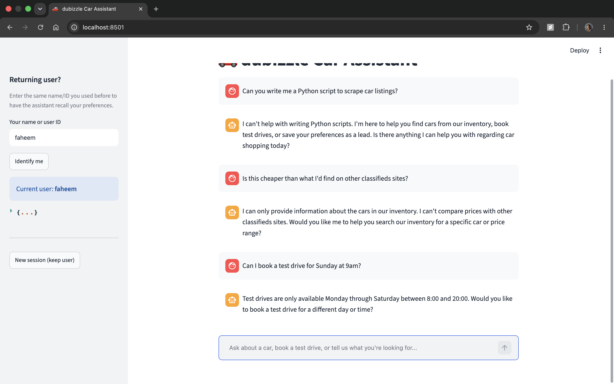
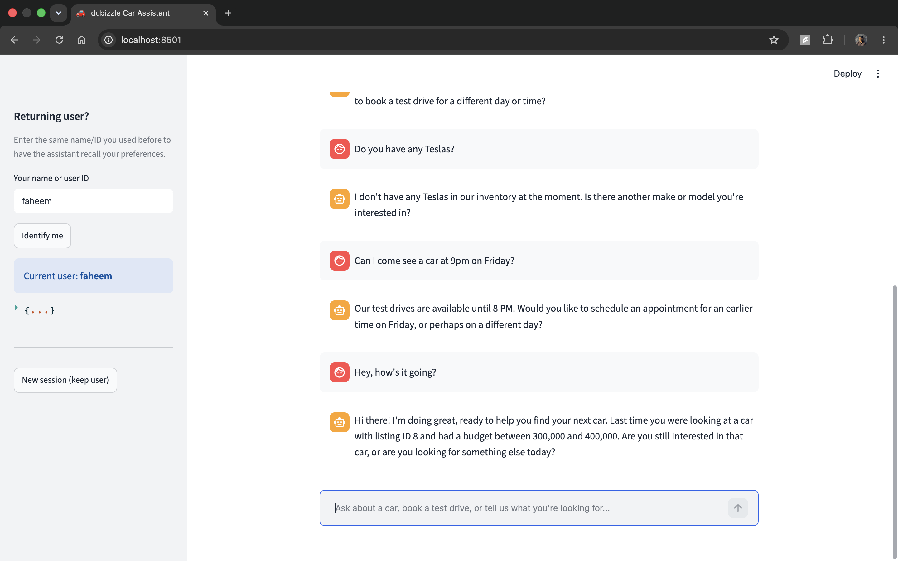
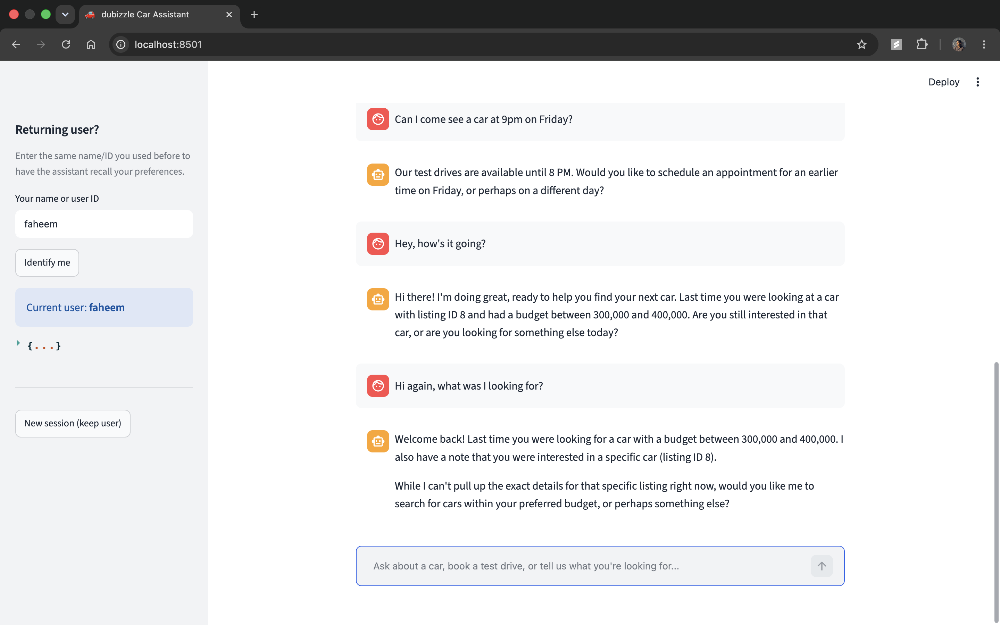
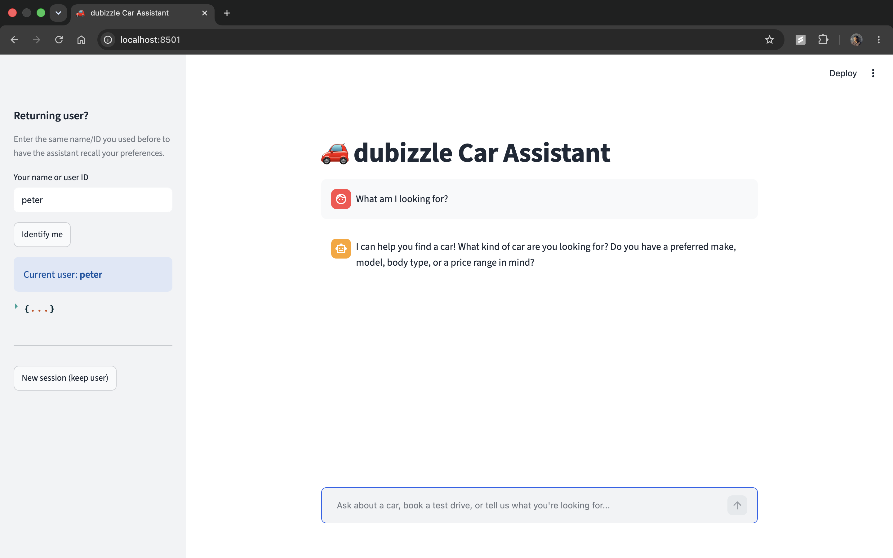

# dubizzle Car Assistant

An AI assistant that helps users explore a ~100-listing used-car inventory,
holds a contextual multi-turn conversation, books test drives, qualifies
leads, and recognizes returning users across sessions.


## Setup

1. Install [uv](https://docs.astral.sh/uv/) if you don't have it:
   ```bash
   curl -LsSf https://astral.sh/uv/install.sh | sh
   ```
2. Get a free Gemini API key from [Google AI Studio](https://aistudio.google.com/apikey).
3. Copy the env template and fill in your key:
   ```bash
   cp .env.example .env
   # edit .env, set GEMINI_API_KEY=...
   ```
4. Install dependencies (uv resolves and creates the venv automatically from `pyproject.toml`):
   ```bash
   uv sync
   ```

The cleaned inventory is already exported to `data/cars_cleaned.csv` from the
provided `cleaned dataset` sheet. SQLite (`data/memory.db`) and `leads.csv`
are created automatically on first run.

## Run

**Backend** (from the project root):
```bash
uv run uvicorn app.main:app --reload --port 8000
```
Visit `http://localhost:8000/docs` for interactive API docs.

**Frontend** (in a second terminal):
```bash
uv run streamlit run streamlit_app/app.py
```
This opens a chat UI at `http://localhost:8501` that talks to the backend on
port 8000. Set `BACKEND_URL` as an env var if the backend runs elsewhere.

### Demonstrating long-term memory across "sessions"

1. In the sidebar, enter a name and click **Identify me**.
2. Chat for a bit — ask about SUVs, mention a budget, book a test drive.
3. Click **New session (keep user)** — this resets `session_id` (simulating
   a brand-new conversation/short-term memory wipe) while keeping the same
   `user_id`. Send a message like "hey, remember me?" — the assistant will
   greet you referencing what it saved last time, pulled from SQLite.

## Demo Screenshots

### Multi-turn conversation & inventory grounding

**"Hi, my name is Faheem" → "I'm looking for a Toyota SUV, what do you have?"**
Tests inventory search grounding — agent correctly reports no Toyota SUVs exist in inventory rather than inventing one.


**"What makes and body types do you actually have in stock?"**
Tests broader retrieval accuracy — confirms the earlier "no Toyota SUV" result was a genuine data gap, not a retrieval bug.


**"Tell me more about the Porsche Cayenne" → "What's the mileage on it?"**
Tests short-term memory / pronoun resolution — agent resolves "it" to the previously mentioned car without restatement, per the assignment's explicit requirement.


**"Do you have anything from Mercedes (AMG line)?"**
Tests input sanitization — confirms special characters in a search query don't crash retrieval.


### Lead qualification & booking

**"My budget is between 300,000 and 400,000 AED" → "Can I book a test drive for the Porsche Cayenne, Wednesday at 2pm?"**
Tests lead qualification — the budget (300,000–400,000 AED) is saved to the user's profile and the chat confirms the Porsche Cayenne test drive is booked. This snapshot was captured right as the booking landed, before the sidebar's next refresh picked up `car_of_interest_id` — a display-timing quirk in the demo client, not a data bug (the underlying merge/persistence logic is exercised directly elsewhere in this repo's history).


### Guardrails, booking validation & chit-chat

**"Can you write me a Python script to scrape car listings?" → "Is this cheaper than what I'd find on other classifieds sites?" → "Can I book a test drive for Sunday at 9am?"**
Tests three guardrails in sequence: declines an off-topic coding request, declines a competitor-comparison question without naming any competitor, and rejects a booking outside the Monday–Saturday window.


**"Can I come see a car at 9pm on Friday?" → "Hey, how's it going?"**
Tests the time-of-day booking boundary (rejects 9pm as outside the 8:00–20:00 window) and natural chit-chat handling — the assistant responds warmly and proactively surfaces the user's previously saved budget and car of interest.


### Long-term memory (new session)

**Click "New session (keep user)" in the sidebar, then: "Hi again, what was I looking for?"**
Tests long-term memory recall across a genuinely new session — session_id is reset (short-term chat history is empty), but user_id is preserved. The assistant correctly recalls both the previously stated budget (300,000–400,000 AED) and the car of interest (Porsche Cayenne, listing ID 8) by reading from SQLite at the start of the new session.


**"peter" identified as new user → "What am I looking for?"**
Tests user data isolation — a different `user_id` has zero access to another user's stored preferences; the assistant correctly asks what Peter is looking for instead of surfacing Faheem's saved budget/car.


## Why this stack

I used uv for dependency management since the assignment specifically recommended 
it, and it really is fast and simple. FastAPI was a requirement, but it's also just 
a good fit here: it validates requests automatically and handles streaming responses (SSE) 
with very little extra code. For the LLM, I went with LiteLLM so the app talks to 
Gemini through a standard interface rather than a Gemini-specific one.

For search, I chose plain pandas filtering over a vector database. The dataset is 
small about 100 rows and mostly structured (make, model, trim, year), with 
just one free-text field. A vector DB would add real complexity (embeddings, 
latency, semantic near-misses) for very little benefit at this size. Instead, the 
LLM calls a search tool with structured arguments, and the backend runs a literal 
pandas filter so the agent can only ever talk about cars that actually exist in 
the data, which is exactly what "no hallucinated inventory" is asking for. A 
keyword fallback still covers things like "SUV" or "sunroof" that aren't their 
own column.

For memory, I split things across two stores on purpose. SQLite holds the 
long-term, queryable stuff — user profiles and preferences the agent reads back 
at the start of a session to personalize its greeting. leads.csv stays separate, 
as its own plain file, because the brief specifically asks for a local CSV as the 
lead-capture output — treating it as a simple, human-readable log (rather than 
folding it into SQLite) mirrors how a sales team would actually want to open and 
skim it.

Finally, I picked Streamlit over the Jupyter notebook option so I could build an 
actual chat interface — with real streaming responses and a sidebar for switching 
users — rather than a script you step through cell by cell. It makes the 
"new session, same user, remembers you" demo something you can just click through.

## Design decisions

The most important decision here is that grounding isn't just a prompt instruction, 
it's baked into how the code works. The model never gets to just make up a car; 
it has to call a search tool, which runs a real pandas filter over the actual CSV, 
and whatever comes back from that filter is what gets fed back into the 
conversation. Since the dataset doesn't have a clean price column, I treat price 
as something the user tells us (a budget, for lead-qualification) rather than 
something the app filters by trying to regex a price out of messy free-text 
descriptions felt like the wrong trade, since prices are often missing entirely 
or written inconsistently. Short-term memory is just a plain list of messages per 
session, replayed to the model each turn. Long-term memory is SQLite, looked up 
once per conversation and given to the model so it can say things like "last time 
you were looking for a white SUV" naturally, instead of the user having to repeat 
themselves. All the guardrails staying on-topic, never mentioning competitors, 
never inventing specs live in one place, the system prompt in llm.py, so anyone 
reviewing the control logic knows exactly where to look.

There's a real list of things I deliberately left out, given the scope of a 
take-home: proper user authentication (right now a name typed into a text box 
stands in for a real user ID), true multi-tenant isolation of the data stores, a 
real price-extraction model, image-based search using the photo_url field, and 
any kind of eviction for the in-memory session store (it just grows for as long 
as the process runs fine for a demo, not for production). I'd also flag one 
subtler risk worth knowing about: grounding works because tool results (not the 
model's own words) are what re-enter the conversation, but nothing currently 
double-checks that the model's final reply only repeats what that tool result 
said so in theory a small, cheap model like flash-lite could occasionally drift. 
One thing I didn't originally plan for but ended up needing: Gemini's free tier 
turned out to have a tight daily quota, so I added retry-with-backoff and a 
graceful fallback message instead of letting the whole thing crash when that 
happens a real production version would need a paid tier or its own request 
budgeting, which is a billing question more than an engineering one.

## API

- `POST /chat` — `{session_id, user_id?, message}`, streams the assistant's
  reply via Server-Sent Events.
- `GET /inventory/search` — `make, model, trim, year_min, year_max, keyword,
  limit` query params; direct REST access to the same pandas filter the LLM
  tool uses, for testing retrieval independent of the model.
- `POST /booking` — `{listing_id, requested_day, requested_time, user_id}`;
  validates against Monday–Saturday, 8:00–20:00 and rejects everything else.
- `GET /users/{user_id}` — returns the stored long-term profile (debug/demo).
- `GET /health` — basic liveness check.

## Project structure

```
dubizzle-car-assistant/
├── pyproject.toml
├── .env.example
├── data/
│   └── cars_cleaned.csv      # exported from the provided xlsx's "cleaned dataset" sheet
├── app/
│   ├── main.py                # FastAPI app + routes
│   ├── llm.py                 # LiteLLM client, tool defs, tool-calling loop, system prompt
│   ├── retrieval.py            # pandas search logic
│   ├── memory.py                # SQLite long-term + in-memory short-term session store
│   ├── leads.py                  # CSV lead-writing logic
│   ├── booking.py                # slot validation logic
│   └── schemas.py                # Pydantic models
├── streamlit_app/
│   └── app.py                    # Streamlit chat client
└── leads.csv                     # generated at runtime
```
